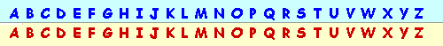

# Computer code

[caesarCipher py](caesarCipher.py)

This program takes a message and a key. The key defines how far the alphabet is shifted over to encode the message.

```sh
Enter a message: Hello, world!
Enter a key: 5
Encrypted: MJQQT, BTWQI!
Decrypted: HELLO, WORLD!
```

You can see here how the message is taken, and then the key's shift is applied such that:

- A -> F
- B -> G
- C -> H
- ...
- V -> A
- W -> B



## Decryption

While this cipher may look secure, it is vulnerable to brute force. You can only shift the alphabet 25 times before wrapping around, and this means we can easy take an encoded message, print every option, and look through them ourselves to find the original.

[caesarCracker py](caesarCracker.py)

```sh
Enter a message to crack: MJQQT, BTWQI!
Key #0: MJQQT, BTWQI!
Key #1: LIPPS, ASVPH!
Key #2: KHOOR, ZRUOG!
Key #3: JGNNQ, YQTNF!
Key #4: IFMMP, XPSME!
Key #5: HELLO, WORLD!
Key #6: GDKKN, VNQKC!
Key #7: FCJJM, UMPJB!
Key #8: EBIIL, TLOIA!
Key #9: DAHHK, SKNHZ!
Key #10: CZGGJ, RJMGY!
Key #11: BYFFI, QILFX!
Key #12: AXEEH, PHKEW!
Key #13: ZWDDG, OGJDV!
Key #14: YVCCF, NFICU!
Key #15: XUBBE, MEHBT!
Key #16: WTAAD, LDGAS!
Key #17: VSZZC, KCFZR!
Key #18: URYYB, JBEYQ!
Key #19: TQXXA, IADXP!
Key #20: SPWWZ, HZCWO!
Key #21: ROVVY, GYBVN!
Key #22: QNUUX, FXAUM!
Key #23: PMTTW, EWZTL!
Key #24: OLSSV, DVYSK!
Key #25: NKRRU, CUXRJ!
```

We don't have to look far to find our original, under key #5, and crack the message.


## [Hub](README.md)
