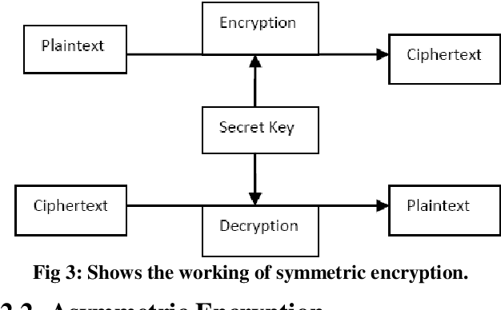

# Ceaser-Cipher
## Mechanics

### How does the cipher work? 
It is quite easy to encode, concidering when this cipher was made. They didn't have a need for such an advance cipher when barely anyone was literate. The way the cipher works is just by shifting alphabetical letter to the left or right for a fixed amount. Caesar would typically move the letters 3 to the left

### Demo an encryption and decryption. Is it symmetric, does the same process decrypt as encrypt?
The Caesar Cipher is a good example of a symmetric encryption. Because the rule of shifting it a certain number of spaces stays the same for encrypting and decrypting, it is symetric. 

## [Hub](README.md)
